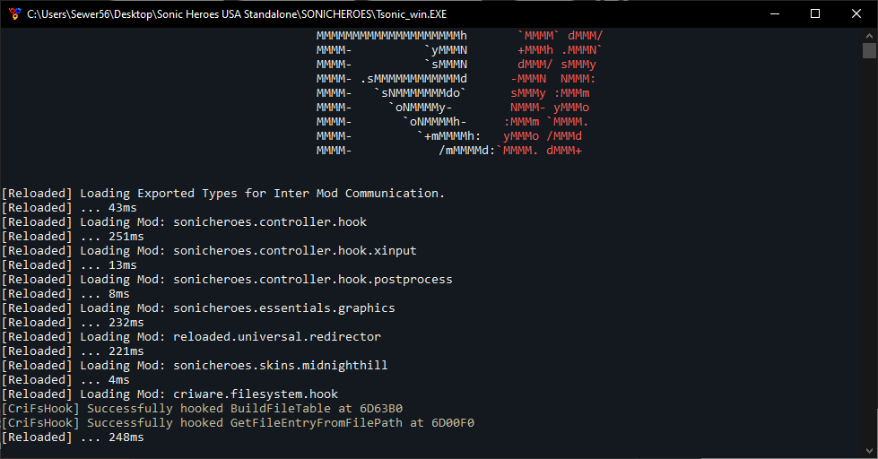

<div align="center">
	<h1>RII Shared Library: Reloaded.Hooks</h1>
	
	<br/> <br/>
	<strong>Sharing is Caring</strong>
    <p>I don't know much about sharing Hookers<br/>
    but having some common Blackjack is ok.</p>
</div>

# Table of Contents

- [About This Project](#about-this-project)
  - [What's the Point?](#whats-the-point)
      - [Fast Startup Times](#fast-startup-times)
      - [Small Mod Sizes & Low Memory Usage](#small-mod-sizes-low-memory-usage)
      - [Self Updating](#self-updating)
  - [When Should I Use Shared Libraries?](#when-should-i-use-shared-libraries)
      - [Supporting Actively Developed Applications](#supporting-actively-developed-applications)
  - [Are There Dangers](#are-there-dangers)
  - [How to Use (End Users)](#how-to-use-end-users)


# About This Project

The following project is a [Reloaded II](https://github.com/Reloaded-Project/Reloaded-II) Mod Loader Shared Library that serves as both an example on how to build a shared library and general documentation for shared libraries. 

A shared library is simply a Reloaded II mod that provides code that can be used by other mods.

## What's the Point?
Normally, each mod is executed by Reloaded II in complete isolation to other mods.

Executing in isolation allows individual mods to use different versions of individual libraries and dependencies: 

e.g. 
- Mod A uses `Reloaded.Memory 1.2.0`
- Mod B uses `Reloaded.Memory 1.4.0`

However in some cases it may be beneficial to unify which version of a specific library is used between individual mods. Here are some reasons why.


#### Fast Startup Times
The main reason this specific library exists is reducing startup times.

When individual mods have their own isolated libraries loaded, each library's code has to be generated by .NET's Just In Time (JIT) Compiler as it gets used. This can cause noticeable delays in startup time.



*Using Standalone Library adds ~220ms of JIT time in every mod that uses it. This amounts to almost 1 second here. Ouch!*

When you use a shared library, as the code is shared, it only becomes JIT-ted once. We go from a JIT startup overhead of 0.9s to 0.2s.

*<TODO: Insert Image of Improved Loads After Switching Mods to Shared Lib>*

#### Small Mod Sizes & Low Memory Usage

The footprint of the standalone `Reloaded.Hooks` library and its dependencies is 1.8MB. This 1.8MB is loaded into memory for every single mod which uses the library, causing memory to be slowly eaten up. 

Have 10 mods? 18MB of memory. Add to that the actual code the JIT generates for each mod in memory, allocated memory and we are probably talking 24MB.

This memory can be saved. If all mods use the same instance, memory usage is only 2.4MB.

In addition, each mod using the shared library can now be 1.8MB smaller. This is a win-win situation.

#### Self Updating

This one is pretty simple to explain. If the library gets updated, all users of the shared library will be able to use the updated version instantly (without recompiling their mods).

If there is a bug in the shared library, the bug will be fixed for all the moment an update to the shared library is pushed.


## When Should I Use Shared Libraries?

In addition to cases outlined above where the use of a shared library might be necessitated, there exists another important use case where the use of shared libraries is recommended.

#### Supporting Actively Developed Applications

As you may or may not have yet experienced, modifying applications which get frequent updates can become very challenging. Every update shuffles around everything in the executables: Functions, variables etc. Many other mod loaders and/or their mod break instantly every update.

This can however be avoided through the use of Shared Libraries.

The goal is to isolate individual mods from accessing a game/application entirely. Mods should instead rely on a shared library, which provides an interface to modify the target application (call functions, access variables), etc.

Shared libraries should then make use of [Pattern Scanning / Signature Scanning](https://wiki.alliedmods.net/Signature_Scanning) (Research this if this is new to you!) in order to automatically be able to re-discover the addresses of functions and variables\* during startup of the application.

**\*Getting variables:** Use signature scanning to find an instruction that accesses a given variable.

```
mov     levelId, edx			// 89 15 [?? ?? ?? ??] <= Level ID
jmp     short loc_4354A1 		// EB OB
mov     someOtherVariable, eax  // A3 ?? ?? ?? ??

// Signature: 89 15 [?? ?? ?? ??] EB 0B A3 ?? ?? ?? ??
// LevelId  : Found Address of Signature + 2
```

This should allow the creation of mods that work with any version of a given application.
As long as the shared library works, all mods work.

In occasional rare exceptions, application code searched by signatures might get changed. This would require replacing a signature or two in the shared library however the probability of that is very, very, very, very low.

For the interested, Reloaded has its own official high performance signature scanning library [Reloaded.Memory.SigScan](https://github.com/Reloaded-Project/Reloaded.Memory.SigScan) with an easy to use interface.

## Are There Dangers
For regular use, shared libraries are completely safe so long that a standalone and shared version of the same library is not used interchangeably inside one mod.

Should a mod use both a standalone and shared version, the standalone version will be overridden by the shared version. Calls to the standalone version in most cases will still continue to work, as long as interfaces (properties, methods) haven't changed too much. 

e.g. Calling a method that does not exist in the shared version will fail.
e.g. But calling a method or field that exists in the shared version will likely work.

The same [rules and recommendations](https://github.com/Reloaded-Project/Reloaded-II/blob/master/Docs/InterModCommunication.md#interface-dlls-are-immutable) apply to Shared Libraries as to mods using Inter Mod Communication.

Note: The mod loader provides protection against sharing unnecessary libraries by only sharing between dependencies. See [Inter Mod Communication: Required Dependencies](https://github.com/Reloaded-Project/Reloaded-II/blob/master/Docs/InterModCommunication.md#required-dependencies).

## How to Use (End Users)

**A.** Install Reloaded mod as usual.

**B.** Nothing else needs to be done. This mod will be auto-enabled if required by other mods.